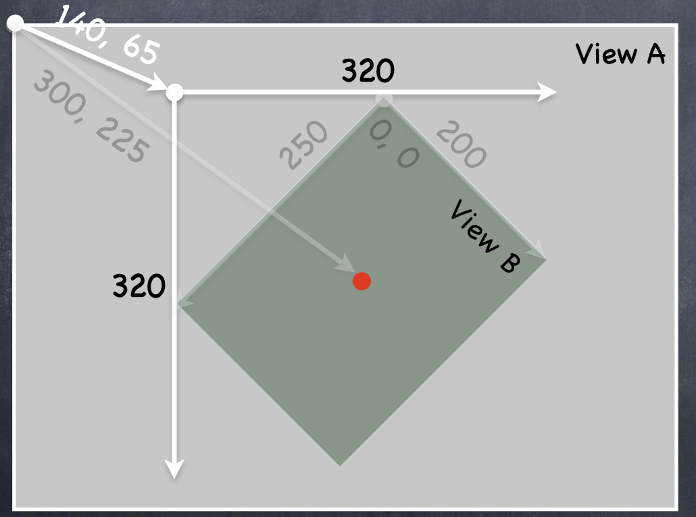

# 5 Drawing

个人理解，本节主要针对的是低层的绘图层次的系统介绍，一般的开发中，不会直接使用到。但是了解iOS的绘图系统有利于更好地开发。

# 5.1 异常

函数使用`throws`关键字表明该函数会抛出异常：

```swift
func function() -> Any throws {}
```

利用`try`来调用声明了`throws`的函数；利用`do...catch`来处理异常；利用`throw`重新抛出异常：

```swift
do {
	try function()
} catch let error {
	throw error
}
```

若希望遇到异常时程序崩溃（或认为函数不可能抛出异常），则使用`try!`调用函数：

```swift
try! function()
```

若希望当遇到异常时程序不直接处理异常，则使用`try?`将出现异常的情况转换为返回`Optional`，此时a为`Any?`：

```swift
let a = try? function()
```

# 5.2 Any & AnyObject

Any代表所有类型，AnyObject仅代表是类对象实例

利用`as?`向上转换类型，若转换失败，则返回`nil`。

```swift
let unknown: Any = ... // we can’t send unknown a message because it’s “typeless” 
if let foo = unknown as? MyType {
	// foo is of type MyType in here
	// so we can invoke MyType methods or access MyType vars in foo // if unknown was not of type MyType, then we’ll never get here
}
```

# 5.3 Views

## 5.3.1 层级关系

View有一个父View：`superview: UIView?`，和多个子View：`subviews: [UIView]`。

可以给View添加子View：

```swift
func addSubview(_ view: UIView)
```

也可以将该View从父View中移除：

```swift
func removeFromSuperview()
```

## 5.3.2 构造函数

View的构造函数有两种，一种是从代码构建的，另一种是从storyboard构建的。

```swift
init(frame: CGRect) // initializer if the UIView is created in code 
init(coder: NSCoder) // initializer if the UIView comes out of a storyboard
```

若是需要添加功能，则需要覆写2个函数：

```swift
func setup() { ... }

override init(frame: CGRect) { // a designated initializer 
	super.init(frame: frame)
	setup() // might have to be before super.init 
}

required init?(coderaDecoder:NSCoder){ // a required, failable initializer
  super.init(coder: aDecoder)
	setup()
}
```

## 5.3.3 `awakeFromNib`

- 参考资料
    - [What is a nib?](https://www.hackingwithswift.com/example-code/language/what-is-a-nib)
    - [Nib file](https://developer.apple.com/library/archive/documentation/General/Conceptual/DevPedia-CocoaCore/NibFile.html)

`awakeFromNib` is only called if the UIView came out of a storyboard. This is not an initializer (it’s called immediately after initialization is complete). All objects that inherit from NSObject in a storyboard are sent this. Order is not guaranteed, so you cannot message any other objects in the storyboard here.

- "NIB" comes from "NeXTSTEP Interface Builder"
- "XIB" from "Xcode Interface Builder"
- nib是storyboard的底层实现方式

# 5.4 View定位系统

## 5.4.1 数据结构

- 参考资料
    - [Core Graphics](https://developer.apple.com/documentation/coregraphics)

这里介绍了CGFloat、CGPoint、CGSize和CGRect。演示项目中也使用了CGAffineTransform。CG为CoreGraphics（另称Quartz）。

- CGPoint包含`x: CGFloat`, `y: CGFloat`
- CGSize包含`height: CGFloat`, `width: CGFloat`
- CGRect包含`origin: CGPoint`, `size: CGSize`

以上参考资料为CG Framework下的所有API。

## 5.4.2 frame & bounds

frame与bounds不一定相同，如下图中View B进行了旋转，则B的bounds为((0,0),(200,250))，frame为((140,65),(320,320))

- 需要注意的是，bounds的起始值始终是(0,0)。



# 5.5 iOS绘图系统

- 参考资料
    - [iOS绘图框架CoreGraphics分析](http://www.cocoachina.com/articles/20187)

项目中多次提到了UIKit、CoreGraphics和CoreAnimation，这里做一个简单的了解。


- UIKit：最常用的视图框架，封装度最高
- CoreGraphics：主要绘图系统，常用于绘制自定义视图，纯C的API，使用Quartz2D做引擎
- CoreAnimation：提供强大的2D和3D动画效果
- CoreImage：给图片提供各种滤镜处理，比如高斯模糊、锐化等
- OpenGL-ES：主要用于游戏绘制，但它是一套编程规范，具体由设备制造商实现

# 5.6 自定义View

定义一个View的子类，并重写函数`draw`来重绘：

```swift
override func draw(_ rect: CGRect)
```

当要求重新绘制时，利用`setNeedsDisplay()`函数重绘。

可以利用两种方式完成重绘：

1. 利用`UIGraphicsGetCurrentContext()`函数获取context，之后调用相关函数绘制；
2. 实例化`UIBezierPath`，利用该对象完成绘制。`UIBezierPath`会自动利用当前的context完成绘制。

重写`override func layoutSubviews()`来处理子View排布情况。

# 5.7 字体

如需要让字体适应系统文字的缩放，可以使用以下方法：

```swift
let metrics = UIFontMetrics(forTextStyle: .body) // or UIFontMetrics.default 
let fontToUse = metrics.scaledFont(for: font)
```

# 5.8 UIImage

一般来讲，图片一般使用`Assets.xcassets`下的资源，此时构造函数的签名为`UIImage(named:)`。

named对应为文件在Assets.xcassets中的名称。若需要添加不同大小的图像，需要添加`@2x`, `@3x`等来标识图片大小。
