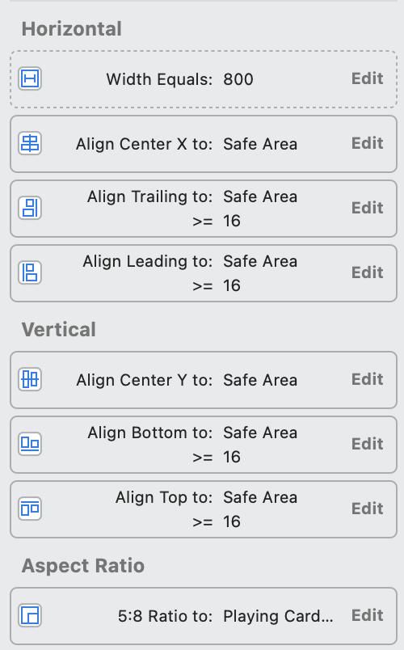

# 6 Multitouch

本节主要利用了上节PPT中介绍的各种技术实现了卡牌的绘制，之后使用了3种触控识别方式实现了翻牌、下一张牌、放缩卡中央图片的功能。

# 约束条件

在storyboard中可以设置多种约束条件。在之前的章节中，设置了与safe area对齐的约束。本节中，则设置了与safe area中心对齐、固定纵横比的约束。

约束条件在`Show the Size inspector`属性中查看，如下图所示：

# #selector

- 参考资料
    - [Swift 中的 Selector](https://www.jianshu.com/p/f3f2c663115d)
    - [@selector() in Swift?](https://stackoverflow.com/questions/24007650/selector-in-swift)

这是个Swift中的语法糖，实际上构建了struct Selector。

这个用法我理解为方法的引用，是为了与Obj-C兼容，因为原有的target/action机制是通过Selector实现的（这里猜测所有的IBOutlet的底层实现都是这样完成的）。若是在其他不需要保持兼容的场景，使用闭包完成更加符合Swift的风格。

需要注意的是，所有被引用的方法都需要声明`@objc`，这是因为Swift和Obj-C函数的实现机制不同；同时，被引用的方法至少有internal的可见性。

# GestureRecognizer

这些是底层的相应手势动作的函数，课程中介绍了`UISwipeGestureRecognizer`、`UIPinchGestureRecognizer`、`UITapGestureRecognizer`，但是可以看到iOS不止这几个`GestureRecognizer`。

需要注意的是，`GestureRecognizer`有枚举内部类`GestureRecognizer.State`，用于标识手势的状态。包含`possible`、`began`、`changed`、`ended`、`cancelled`、`failed`几种状态，它们具体的作用可以参考文档。大多数情况下我们需要响应`changed`和`ended`状态。

# storyboard即时渲染

在View类上声明`@IBDesignable`，可以在storyboard中实现即时渲染；

在View类的成员变量上声明`@IBInspectable`，可以在编辑器中实时的修改该变量的数值。

# traitCollectionDidChange

iOS中有一个`UITraitCollection`类，该类包含了iOS环境的信息。`UIScreen`, `UIWindow`, `UIViewController`, `UIPresentationController`以及`UIView`都有成员变量`traitCollection`来获取iOS环境特性。

若是要响应`traitCollection`变化的事件（例如本节中的屏幕方向变化），可以覆写`traitCollectionDidChange`。
